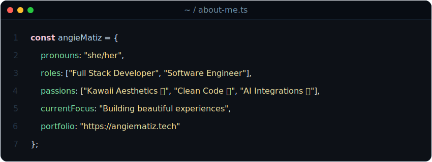

<!-- 
  ¡Hola Angie! Este es un README para tu perfil de GitHub (el repositorio que se llama igual que tu usuario: MinAnnie/MinAnnie).
  Está diseñado con los colores de la paleta de tu portafolio y un estilo kawaii-IDE.
  Puedes copiar y pegar este contenido en tu README.md de GitHub.
-->

  

# 🌸 Hi there, I'm Angie Matiz! 

  

### 👩🏻‍💻 `<AboutMe />`

  

### 🛠️ `<TechStack />`

  <!-- Languages -->
  
  
  
  
  
  
  
  
   

  <!-- Frontend -->
  
  
  
   

  <!-- Backend & Database -->
  
  
  
  
  
   

  <!-- Tools & Infrastructure -->
  
  
  
  
  

### 📡 `<Connect />`

  
  
  

---

### 🌟 `<DailyQuote />`

  

### 📝 `<LatestWritings />`

  

---

### 🐍 `<Contributions />`

  <picture>
    <source media="(prefers-color-scheme: dark)" srcset="https://raw.githubusercontent.com/MinAnnie/MinAnnie/output/github-contribution-grid-snake-dark.svg">
    <source media="(prefers-color-scheme: light)" srcset="https://raw.githubusercontent.com/MinAnnie/MinAnnie/output/github-contribution-grid-snake.svg">
    
  </picture>

